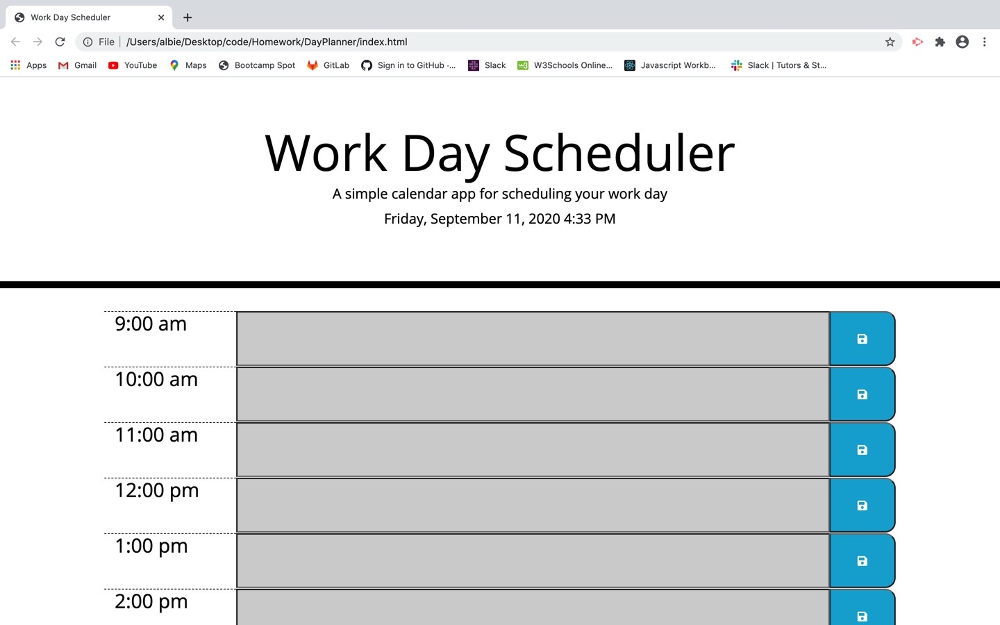
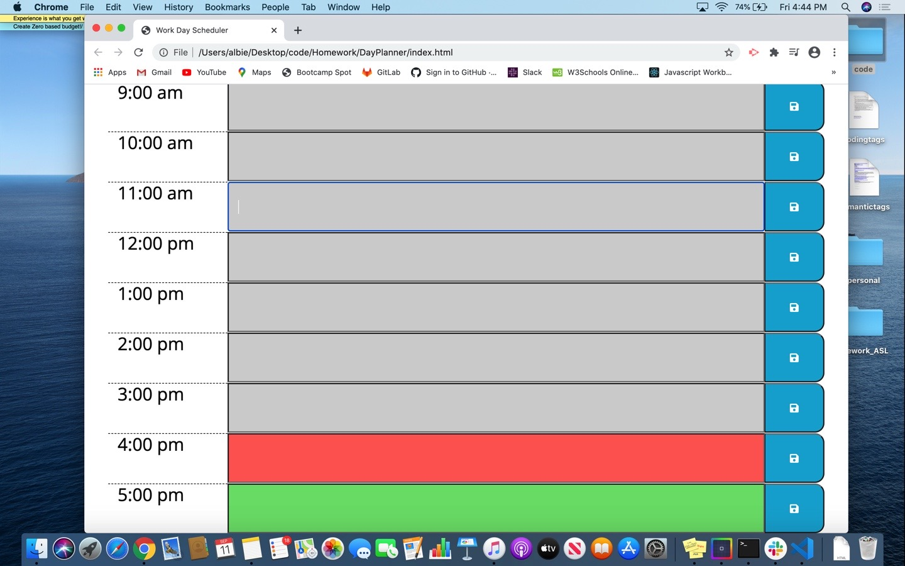

# DayPlanner

For this assignment, I created a Day Planner for a busy employee. With this Day Planner, the employee will be able to add and delete events in the time slots. The time slots available are from 9 am - 5 pm. The planner is also formatted to take into account the current time of day. Any time slots that are in grey are no longer available. The time slot in red, is for the current hour block. The green slots are available for scheduling. This will help keep the busy employee on time and organized.

See screenshots below.

Deployed application:  https://albie140.github.io/DayPlanner/

# Technologies used:
HTML, CSS, JavaScript

# Questions?
Email: alberte.laventure@gmail.com

